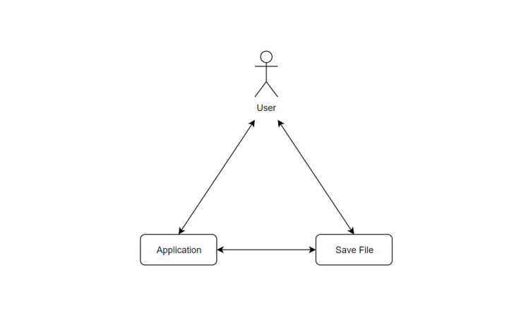
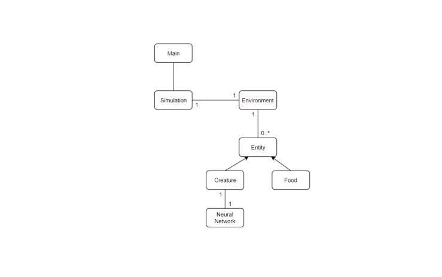
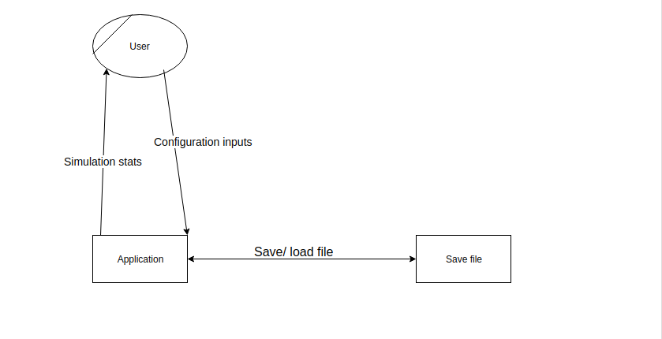
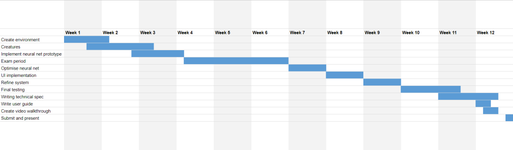

# Functional Specification

## 0. Table of contents

---

1. Introduction
- 1.1 Overview
- 1.2 Glossary
2. General Description
- 2.1 System Functions
- 2.2 User Characteristics
- 2.3 Operational Scenarios
- 2.4 Constraints
3. Functional Requirements
4. System Architecture
5. High-Level Design
- 5.1 Object Model
- 5.2 Data Flow Diagram 
6. Preliminary Schedule
7. Appendices

{:toc}

## 1. Introduction

---

### 1.1 Overview

The system we are developing is a program that allows users to run simulations to show the evolution of artificial beings in a simulated environment. The creatures will be created with a number of preassigned attributes, and will be controlled by neural networks. Successful creatures will be able to survive and eventually reproduce, with the aim of passing their successful genes on to further generations.

Users will be able to set different configurations for the worlds' starting parameters, such as the base population, population end goals, and climate distributions. Environments and creatures can be saved and loaded into simulations at any point, so that the user may see how different configurations affect the evolution of the beings.

### 1.2 Glossary

C#
: C# is a general-purpose, multi-paradigm programming language encompassing strong typing, lexically scoped, imperative, declarative, functional, generic, object-oriented, and component-oriented programming disciplines.

Monogame
: Monogame is a C# framework based commonly used by developers for its graphical capabilities.

Machine learning
: Machine learning is the scientific study of algorithms and statistical models that computer systems use to perform a specific task without using explicit instructions, relying on patterns and inference instead. It is seen as a subset of artificial intelligence.

Artificial neural network
: Artificial neural networks are computing systems that are inspired by the networks of neurons that make up biological brains. They have inputs that go through some amount of hidden layers, the weights and biases of which determine the outputs.

Neuron
: In an artificial neural network, a neuron is a function that receives some amount of inputs to produce an output.

Crossover
: Crossover is a genetic operator used to generate new offspring using the combined genetic information of two parents.

## 2. General Description

---

### 2.1 System Functions

The program will launch to a main menu. From here the user can choose to start a new simulation, or load a simulation that was previously saved.

The two main elements of a simulation are the environment and the creatures.

The user will be able to configure many of the parameters of the simulation, and will be given the opportunity to do this immediately after choosing to create a new simulation. There will be preset configurations for the user to choose between as an alternative to manually adjusting all of the configuration options.

The size of the environment will determine the width and height of the map that the beings will exist in. This can only be set on the creation of the environment, and can not be adjusted afterwards.
The minimum population is the minimum number of creatures that will exist in the simulation.
The climate can be configured to decide the lowest temperatures, the highest temperatures, and how long a season lasts.
The land / water ratio determines how much of the environment is made up of dry land.

The user will be able to adjust the hyperparameters of the neural networks that the creatures are controlled by, including the number of hidden layers, as well as the number of neurons in each layer. This can not be changed after the initial population of this creature is created.

The environment will be generated, defined by the starting parameters chosen by the user. The land on the map will be generated randomly, based on the land / water ratio. Different areas of the dry land will have different levels of vegetation. The level of vegetation of an area of land determines how often food spawns in that area, with higher vegetation resulting in a higher spawn rate. As time passes in the environment, the temperatures will gradually rise and fall, based on how the climate was configured.

Creatures will each be made up of a neural network, as well as a number of physical attributes. The hyperparameters of the network will be decided based on the options set by the user during the initial configuration. Physical attributes will include the creature's maximum speed, strength, and health. The weights and biases of the network, as well as the physical attributes, are what make up the genes of each creature.

When the creatures are first generated, they will be generated completely randomly. The weights, biases, and physical attributes will all be completely random numbers within a range. The number of creatures that are initially spawned is decided by the minimum population of the environment. Whenever the population drops below this minimum population, a new completely random creature will be generated, to keep it level to the minimum.

Creatures will have a certain amount of energy, which will constantly be changing based on the creature's actions and surroundings. The energy will gradually deplete, as the creature uses it to live. If the energy drops below a certain threshold, the creature will die, and its body will become food for other creatures to consume. Attempting to perform actions such as moving, eating, attacking, and reproducing will cost different amounts of energy. The rate of energy depletion depends on a number of different factors. A creature moving faster will use more energy than a creature moving slower. A creature with a higher maximum health passively uses more energy than a creature with a lower maximum health. The current temperature, which is decided by the environment's climate, also affects energy costs, as creatures use more energy the colder it is.

Energy can be raised by eating food. Food comes in the form of naturally spawned food in certain areas of the map, as well as in the form of the dead bodies of other creatures.

Creatures can attack each other when in range, depleting the health of the targeted creature. If health drops to 0, the creature dies. Creatures can attempt to reproduce, though certain conditions must be true for it to be successful. Both creatures must want to reproduce, and they must be in range of one another. Reproduction takes a large sum of energy from both parents to create a new child. The child will be created using genes from both parents' genes, using some form of crossover.

The neural network of a creature will have a number of inputs and outputs. The inputs will be there to allow the creature to perceive its surroundings. Each creature will have some number of points, some in front, and one at its center. Each of these points will provide information on the space that it takes up, by passing the colour of the land or object as input to the creature. Attributes such as the creature's energy level will also be included as inputs.

The outputs will determine what actions the creatures will take. Speed and angle will decide how the creature moves. An attack output will cause the creature to attempt an attack when it reaches a certain threshold. A reproduction output will cause the creature to attempt to reproduce when it reaches a certain threshold. If the reproduction output is below some level, the creature will not allow other creatures to reproduce with it.

The user can at any point choose to display a user interface to view some information about the current simulation. This will show how much time has passed for this environment, as well as the current temperature and season. A list of currently living creatures will be visible, with statistics including the creature's current age and generation. This list can be used to focus the user interface on different creatures, to show more information. A visualisation of the creature's genes and statistics will become visible on the screen.

At any point during the simulation, the current state of the environment, creatures, or the whole simulation can be saved to a file to be loaded later.

### 2.2 User Characteristics and Objectives

Users of the system should only require a basic to moderate knowledge of computers. We plan on creating an executable file to launch the program so that users will easily be able to run it.

There will be a basic GUI that should be easy and intuitive for users. It will only have a small number of functions available such as new simulation, load simulation and exit the program to make it simple to understand.

The objective of the program from the users perspective is to be able to create and run an evolution simulation. The user should be able to edit save states and configurations to see the effect that changing the environment and neural networks has on the simulation.

### 2.3 Operational Scenarios

The user will start the program from a C# application on their desktop. This will bring up the start menu. The menu will have have the option to either create a new random simulation, load a previously saved simulation, create a custom simulation or exit the program. The new simulation option will bring the user to a new screen that begins running the simulation. If load is selected a menu of all saved simulations will show up and the user will choose a simulation to run. If the configuration option is chosen the user will be prompted to input certain custom attributes for the simulation. The exit button will quit the program.

Once a simulation has been selected it will start to run. The user can let this run with no interaction if they want. There will be a sidebar displaying different statistics. The user can choose to view overall world statistics or select a specific being to view their attributes. They can have the option of pausing and resuming the simulation.

When the user is finished viewing the simulation they can open up the menu. Here they have 2 options to exit the program. They can either save the simulation state by clicking on the save button which prompts them to name their save and then exits the program or exit the simulation without saving.

### 2.4 Constraints

Hardware
: The program will need to be run on hardware capable of allowing the simulation to run at reliable speeds. The PC will need to have a CPU capable of running a program with multi threading. Most modern PCs and laptops including the ones in the School of Computing meet these requirements. 

Software
: The program will need to run on a computer capable of compiling and running C# programs. 

Time
: There is a small development window for completing the project which must be finished before the due date on the 6th of March 2020. This time also includes a two week exam period which will stop development.

## 3. Functional Requirements

---

### 3.1 Creating Simulation

Description
: Creating the simulation involves making an environment in which there are creatures that can move around, eat, reproduce and fight. Creatures will have their decisions controlled by neural networks. The environment will consist of different climates and food spawn rates. 

Criticality
: This is the most important aspect of the project as all aspects of the system rely on some form of working simulation. Without this there is nothing other than a non working menu to display

Technical issues
: This is the most technical aspect as it requires us to implement machine learning for controlling the creatures. We will have to learn C# and neural networks for this part of the system.

Dependencies with other requirements
: There are no dependencies on any other parts of the project as this is what other functions are based off.

### 3.2 Creating a graphical user interface(GUI)

Description
: This function will allow users to start worlds from a main menu. Once a world has been started the GUI will be used to display statistics about beings in the world, such as population size, age and energy for each being. It should also display statistics about other environmental factors, such as climate, time and amounts of food.

Criticality
: This is a critical part of the user experience, as it allows the user to visualise the simulation.

Technical issues
: Neither of us have ever created any GUIs using C# before, which could potentially be a problem. Also, our UI design decisions could potentially become a minor issue for user experience.

Dependencies with other requirements
: This function depends on our ability to create the simulated worlds for the interface to display and interact with.

### 3.3 Saving and loading simulations

Description
: The user should have the option to either create a new world or load a previously saved the world from a saved file. While in the chosen simulation the user should also be able to exit and save the state of their world. 

Criticality
: This function is not an essential part of the system. However, we think that it is important for the overall experience that users can have multiple simulations and also be able to come back to view previous simulations. 

Technical issues
: It could prove difficult to store saved states in an efficient way. We would have to figure out an efficient way to store saved simulations locally on the users machine without taking up too much storage space.

Dependencies with other requirements
: This function depends completely on our ability to create simulated worlds, as well as a working GUI.

### 3.4 Adjusting simulation configurations

Description
: Adjusting configurations for simulations will allow the user to change environment variables. These include the number of starting creatures, food spawn rates, world size and climates. The user will be able to have the option of starting a new world with their own chosen parameters.

Criticality
: This is the least critical function as it is only there for users to be able to create their own custom simulations. Without it simulations can still be created with random or preassigned variables.

Technical issues
: The main technical issue is that users could potentially enter invalid data that will cause errors in the system, which if not properly handled could cause the program to crash.

Dependencies with other requirements
: As with the previous function, this function depends completely on our ability to create simulated worlds, as well as a working GUI.

## 4. System Architecture

---
System architecture diagram.

## 5. High-Level Design

---
### 5.1 Object model

### 5.2 Data flow diagram

## 6. Preliminary Schedule

---

We created a GANTT chart below to follow during the development of the project. This may be subject to change due to unforeseen time constraints.

## 7. Appendices

---

**References**

- [Monogame](http://www.monogame.net/)
- [C# definition](https://en.wikipedia.org/wiki/C_Sharp_(programming_language))
- [Machine learning definition](https://en.wikipedia.org/wiki/Machine_learning)