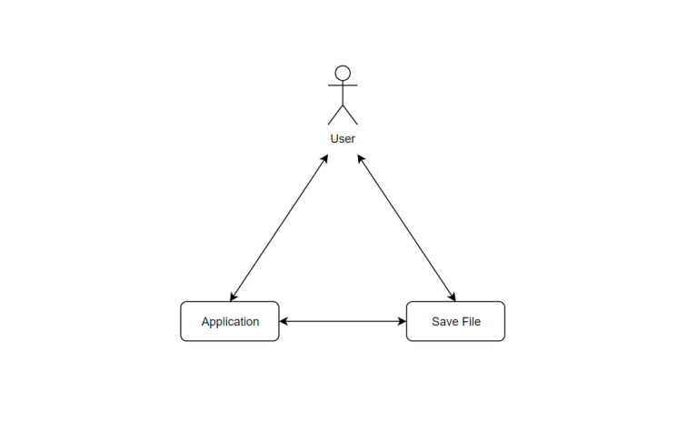
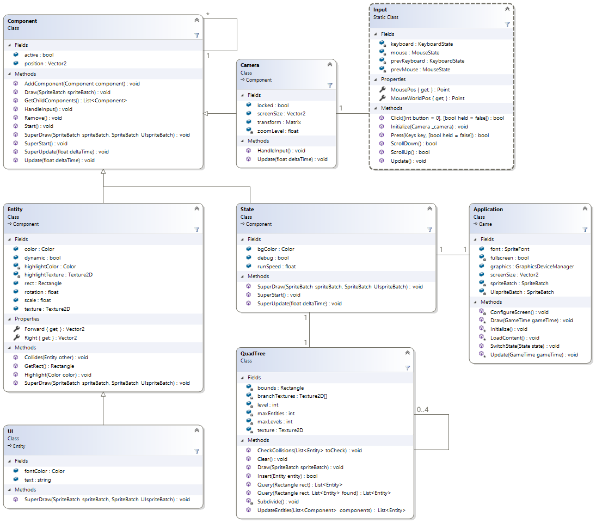
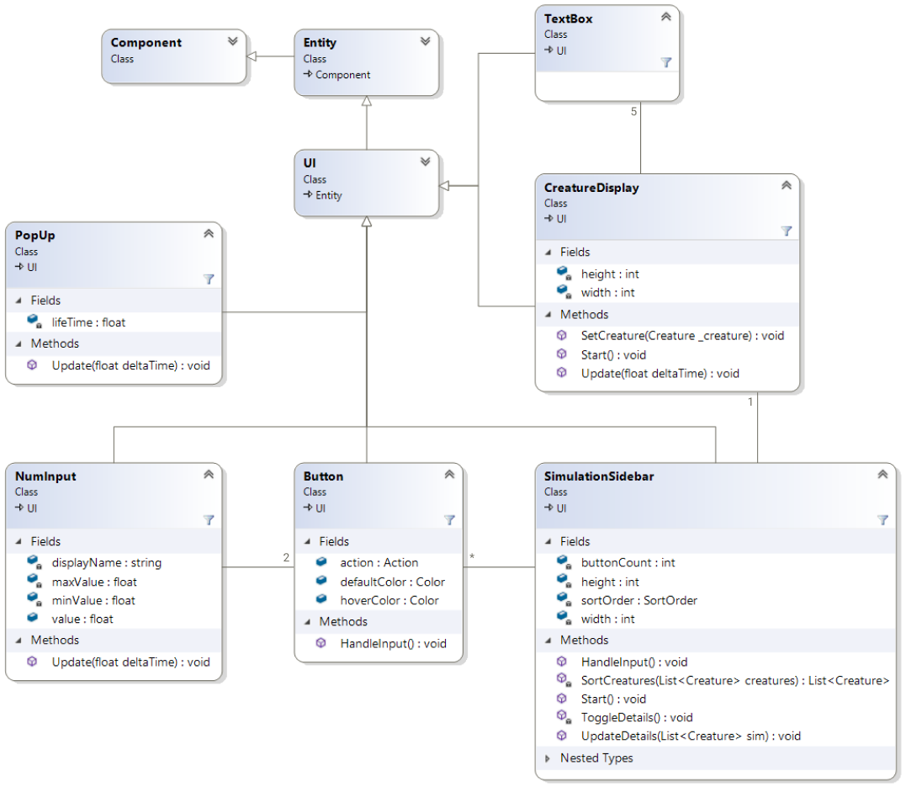
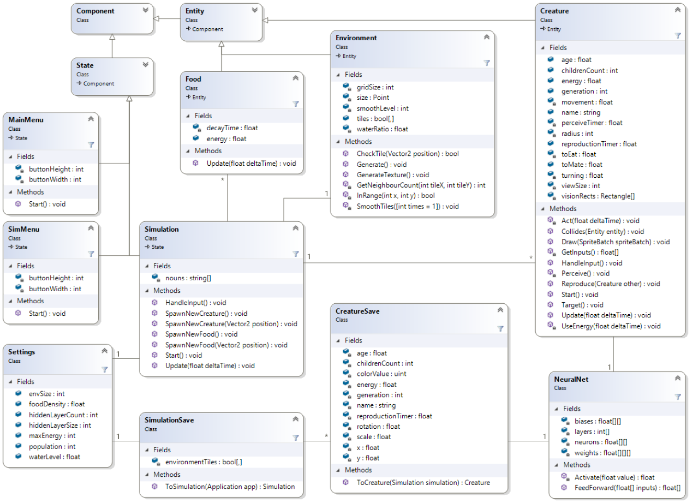
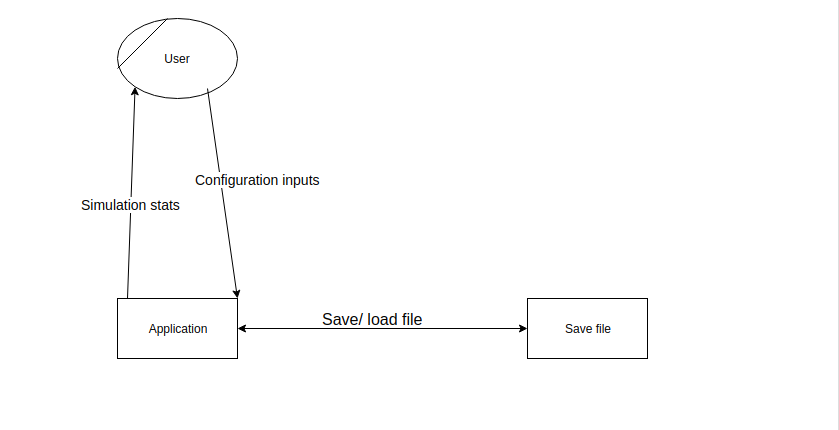
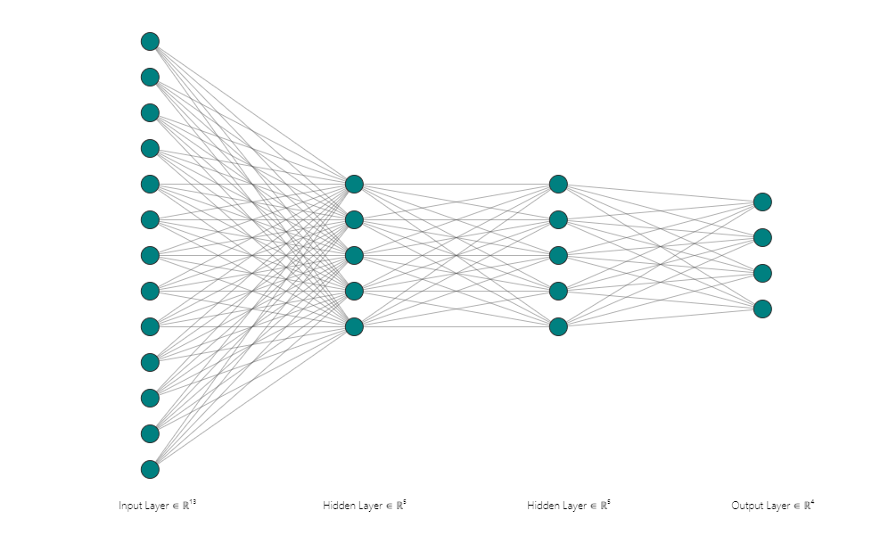

# EDEN Technical Manual

- **Sean Dyer**
- **Sean Brereton**

# 0. TOC

1. Introduction

- 1.1 Overview
- 1.2 Glossary

2. System Architecture

3. High-Level Design

- 3.1 Class Diagram
- 3.2 Data Flow Diagram
- 3.3 Feed-Forward Neural Network Diagram

4. Development and Testing

- 4.1 Development
- 4.2 Neural Network Unit tests
- 4.3 Other Unit tests
- 4.4 Functionality Tests
- 4.5 Heuristics Testing

5. Problems and Resolution

6. Installation Guide

- 6.1 Software and Hardware Requirements
- 6.2 Installation Steps

## 1. Introduction

### 1.1 Overview

EDEN is a program that simulates evolution of simple creatures that are controlled using neural networks. EDEN is built using C# and Monogame. Creatures live in an environment that is comprised of land and water and food that spawns on land. Their objectives are to survive for as long as possible by finding and eating food and to reproduce by finding a suitable mate. Water is a challenge for them as it drains their energy much quicker than staying on land.

The system consists of a main menu, a simulation setting menu and the actual simulation itself. The main menu allows a user to start a new simulation, load a previous simulation or quit the application. A simulation menu appears if a user clicks on new simulation. This lets a user either start a new simulation with the default settings which we chose or they can start a new simulation with their own custom settings such as population size and water ratio. Once a simulation has been started the environment and creatures are spawned in. There is a simple GUI that shows the user statistics about the creatures including age, how many children they have and what generation the creature is.

The creatures in the simulations use a basic Feed Forward Neural Network. This takes in inputs such as nearest food, nearest creature and its own energy. These inputs go through a number of hidden layers and produce 4 outputs. Hidden layer size can be set by the user in the custom simulation option. The 4 outputs are speed, direction, whether or not to eat and whether or not to reproduce. If a creature is spawned from the simulation and does not have parents it is given random behaviours. If these creatures are successful in reproducing their genes will be passed onto future generations.

### 1.2 Glossary

#### *Artificial Neural Network*

- Artificial neural networks are computing systems that are inspired by the networks of neurons that make up biological brains. They have inputs that go through some amount of hidden layers, the weights and biases of which determine the outputs.

#### *Feed Forward Neural Network*

- A feedforward neural network is an artificial neural network wherein connections between the nodes do not form a cycle. As such, it is different from recurrent neural networks

#### *C#*

- C# is a general-purpose, multi-paradigm programming language encompassing strong typing, lexically scoped, imperative, declarative, functional, generic, object-oriented, and component-oriented programming disciplines.

#### *Monogame*

- Monogame is a C# framework based commonly used by developers for its graphical capabilities.

#### *QuadTree*

- A quadtree is a tree data structure in which each internal node has exactly four children. Quadtrees are the two-dimensional analog of octrees and are most often used to partition a two-dimensional space by recursively subdividing it into four quadrants or regions.

#### *GUI*

- The graphical user interface (GUI) is a form of user interface that allows users to interact with a system through graphical icons.

## 2. System Architecture



- In the diagram above a user opens up the application.
- From here they can access save files, which go back through the application and are displayed to the user.
- They can also access the application and run a simulation without accessing the save files.
- Or the user can start the application through a saved file.

This diagram ended up being the same as in the functional specification

## 3. High-Level Design

### 3.1 Class Diagram









### 3.2 Data Flow Diagram



The Data Flow Diagrams is also the same as in the functional specification.

### 3.3 Feed-Forward Neural Network Diagram



- In this diagram the inputs nodes on the left go through 2 hidden layers of 5 nodes each.
- There are 4 outputs on the right.
- The inputs must be 13 nodes and the outputs must be 4 nodes.
- The amount of hidden layers and the size of them can be adjusted for more or less complex calculations.

## 4. Development and Testing

### 4.1 Development

The system was developed using C# and Monogame. Monogame proved to be very useful for a number of reasons. The boiler plate code allowed us to easily set up a window and change it's size. Monogame also made it relatively easy to handle keyboard and mouse input.

```C#
public static bool Press(Keys key, bool held = false) {
    return keyboard.IsKeyDown(key) && (held || prevKeyboard.IsKeyUp(key));
}
```

This method allows us to easily check if a key was pressed. `IsKeyDown()` is a built in monogame method that returns a `bool` to see if a key is being pressed.

Monogame also made graphics a lot easier. The built-in `Draw()` function makes it easy to draw textures to the screen. This was useful for displaying creatures and the environment.

Overall the development of the project was quite smooth, aside from a few minor problems along the way. We implemented all the major features that we had planned to do in the functional specification. The main thing we changed was deciding against implementing fighting between creatures as we didn't feel like it would have much benefit.

If we had more time to develop the project we would have made more improvements to the User Interface. We also would have tested different configurations for simulations and make other small environment changes to see the effects they would have. If we had gotten ethical approval sooner we would have also liked to have external users test the system to get feedback about the UI and the simulation itself.

### 4.2 Neural Network Unit tests

For the neural network we made unit tests to determine whether or not the outputs were normalised between the correct range of -1 and 1. This is very important for the functionality of the neural network.

Below is an example of a unit test for the neural network.

```C#
public bool AllWithinRange(float[] outputs) {
    foreach (float output in outputs)
        if (output < -1 || output > 1)
            return false;
    return true;
}

public bool FFTestBase(float[] inputs, int hCount, int hSize, int outSize) {
    NeuralNet network = new NeuralNet(inputs.Length, hCount, hSize, outSize);

    return AllWithinRange(network.FeedForward(inputs));
}

[TestMethod()]
public void FeedForwardTest1() {
    float[] inputs = { 0, 0, 0 };
    Assert.IsTrue(FFTestBase(inputs, 3, 3, 3));
}
```

### 4.3 Other Unit Tests

Other unit tests were performed throughout the system. Unit tests were performed for the Rand class. This made sure that methods in the class were returning random values of the correct type and in the correct range that was provided.

Below is a sample test from the Range test class.

```C#
[TestMethod()]
public void FloatRangeTest1() {
    float min = -2.3f;
    float max = 3.1f;
    float value = Rand.Range(min, max);
    Assert.IsTrue(InRange(min, max, value));
}
```

### 4.4 Functionality tests

To test the functionality of our system we walked through the application to check the functionality of different elements of it. We checked functionalities such as loading simulations by trying to load invalid files. Initially it crashed the program. We added error handling which now gives an error message on the menu if an invalid file is chosen. We also tested it with valid `.bin` simulation save files


We tested other aspects of the menu such as custom simulation configurations. We tried starting simulations with different configuration variations.  Since users are limited to the input values they can use there were no errors when trying this.

Tests were also done to check the functionality of the actual simulation. We tested things like camera functionality, saving and exiting of the simulation, whether or not creature and environment attributes were being displayed correctly on the sidebar.

### 4.5 Heuristics Testing

To test the User Interface we looked at Jakob Nielsens' 10 general principles for interaction design

1. We made sure the system status was always visible by showing users information about the current simulation on the sidebar at all times when running.

2. To make sure the users understand the language of the system we designed the UI using words familiar to the average user.

3. We gave the user control and freedom by adding back buttons in the menu in case they didn't want to choose a certain option. Also in the simulation users can save and exit when they want.

4. We made sure words and actions had the same meaning throughout the program.

5. For example to prevent errors in creating simulations we made it so users can only choose values within a certain range.

6. To minimise the user's memory load we made all information easily visible while the simulation runs.

7. There are keyboard shortcuts that can be used by an experienced user to speed up their interaction such as pressing Shift while moving the camera to speed up the camera. This still caters to inexperienced users as it is not important to the function of the program.

8. We designed the UI to have a minimal aesthetic so there is not too much unnecessary information displayed.

9. There are error messages in place to help the user. For example if they choose an invalid file to load as a simulation and error message pops up to tell the user that they have chosen a wrong file.

10. If a user has trouble with the system they can use the user manual to help them.

## 5. Problems and Resolution

- **Problem:** The biggest problem we encountered was the efficiency of the program.  **Resolution** We found that our initial method of collision detection used a lot of computation power when there were a lot of entities in the simulation. Initially, every entity was checked against each other each frame which got very slow with a large number of entities. We found that a data structure called a quadtree made these collision checks much more efficient.
- **Problem:** Some creatures lived too long by going in circles at maximum speed, collecting food. **Resolution:** We changed the energy and movement system to try and prevent this. Now moving faster uses up more of a creature's energy than if it were to move slower.
- **Problem:** Not many creatures were willing to reproduce which made simulations end very quickly. **Resolution:** We made it easier for creatures to reproduce by making it cost less energy to do so. This meant more creatures reproduced, therefore passing on the more successful genes.
- **Problem:** We found that creatures did not have enough of a challenge other than finding food. **Resolution:** To solve this we added water to the environment. If a creature is in water they use up 4 times more energy than they would if they were on land. This led to more thoughtful behaviours in some creatures such as avoiding water or moving slowly through it to use less energy, whereas others died very fast in water.
- **Problem:** Towards the end of development we found that most simulations gave very similar results. **Resolution:** We ended up implementing more customisable simulations where users can set population size, food spawn rates, environment size, maximum energy, water ratio and hidden layer settings. This resulted in more varied simulation results.

## 6. Installation Guide

### 6.1 Software and Hardware Requirements

- Windows OS

If building from source:

- Visual Studio 2019
- Monogame version 3.7.1
- C# version 7.3

### 6.2 Installation Steps

There are 2 different ways of installing the system. We recommend using the first option as it is much faster and easier to use the download link.

#### From Download

- Download the zip folder from <https://gitlab.computing.dcu.ie/brerets4/2020-ca326-sbrereton-eden/blob/master/EDEN.zip>
- Unzip the folder.
- Open the folder and click on the file named `EDEN.exe`.
- This will open the application.

#### From Gitlab

- If Visual Studio 2019 is not already installed it can be downloaded at <https://visualstudio.microsoft.com/downloads/>.
- Monogame also needs to be installed to run. This can be downloaded at <http://www.monogame.net/downloads/>.
- When monogame and visual studio are downloaded the repo can be cloned or downloaded from <https://gitlab.computing.dcu.ie/brerets4/2020-ca326-sbrereton-eden> and opened in Visual Studio.
- Once a solution has been made build and run through Visual Studio by pressing F5
