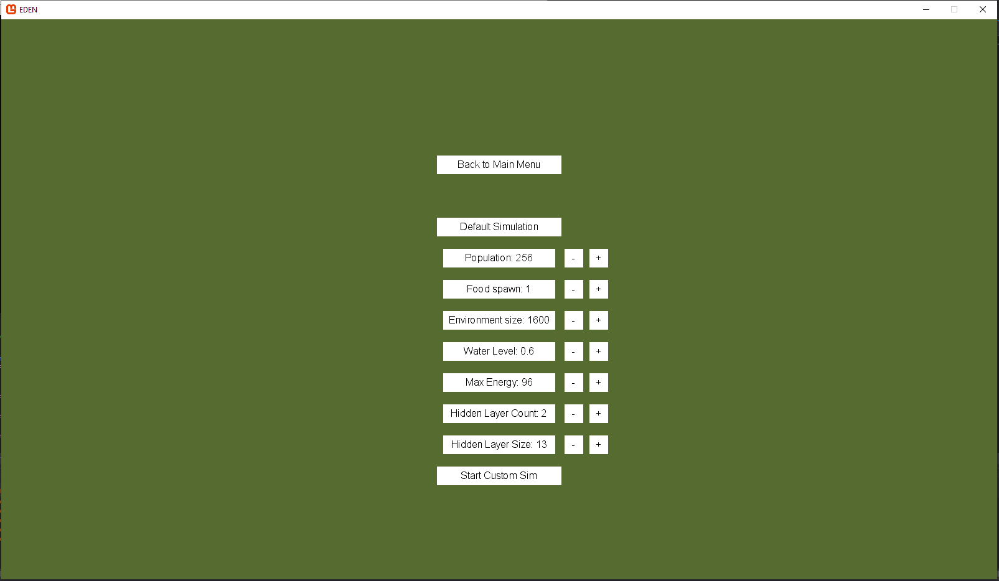

# Eden User Manual

## TOC

{:toc}

## 1. Installation

- The application can be downloaded at .....
- For Windows click the something.exe

## 2. Starting Simulation

When the program is launched a start menu opens up. There are multiple options that the user can choose from here.

### 2.1 Main Menu

This menu is the first menu that is shown when the program is launched. Here there are 3 buttons. The first button is "New Simulation". If this button is pressed a new menu is opened to choose simulation settings. The second option is the "Load Simulation" button. The last button it the "Quit" button. When this is pressed the application will stop and exit.

The image below shows what the main menu looks like when the program is started.

### 2.2 Simulation Menu

If the "New Simulation" button from the main menu is chosen, the user will be brought into the simulation menu. The simulation menu has a number of options.

The first option is to start a simulation using default settings. This will load in a simulation using the preset options for population size, food spawn rates, environment size and the maximum energy a creature can have.

If you do not choose the Defualt simulation, you can configure 4 different aspects of the simulation.

- The first configurable option is to set the initial population. Using the "+" and "-" buttons, you can make the starting population higher or lower. The lowest population option is 128 creatures and the highest is 1024 creatures.
- The second option is to set the food spawn rate. This rate is relative to the population. For example, if the starting population is 256 then a rate of 1.2 will spawn 307 pieces of food. The lowest rate is 0 and the highest is 2.
- The third option is to set the environment size. This makes the environment as a square with height being the chosen number. The lowest option is 320 x 320 and the highest option is 3200 x 3200.
- The last configurable option is to set the maximmum energy for creatures. If the maximum energy is 96, this means that a creature will have a maximum of 96 seconds to live if they do not eat more food. The lowest option is 48 seconds and the highest option is 192 seconds.

Below is a picture of the simulation settings menu.

### 2.3 Load Simulation

If this is chosen a Windows File Explorer window will pop up. From here you can look through your previously saved simulations that are saved as .bin files. When you choose the simulation you want to open you can double click that file and it will launch the simulation.

## 3. Using the simulation

When a simulation is started it will run itself without the need of any user interaction. However there is a User Interface that can be used to look at statistics. There are also other keyboard controls that the user can use.

### 3.1 Understanding the GUI

- When the simulation is running there are a few GUI features. On the left hand side of the screen there is a list showing creatures statistics. It shows their name, age, how many children it has and what generation it is. The list is automatically sorted by age.
- In the actual simulation creatures are depicted as round entities with eyes. There is also food which spawns that is depicted as a white square. When a creature dies it drops food that is the same colour as the creature was. Land is shown as a green colour and water is blue.

### 3.2 Controls

- There is a camera that can be used to navigate the simulation. To zoom in and out you cane either use the "+' and "-" keys or use the mouse scroll wheel. Users can also move around the simulation using the keyboard. The "W" or Up arrow keys move the camera up. The "S" or Down arrow keys move the camera down. The "A" or Left arrow keys move the camera left. The "D" or Right arrow keys move the camera right. Pressing the Shift key makes zooming and moving the camera faster while it is held down.
- There is also a quad tree visualiser that can be shown by pressing the "Q" button. This shows how the screen is split into sections by the quad tree.
- A user can also left click on a creature. This focuses the camera on the selected creature and follow it until the user moves the camera manually.
- The simulation speed can also be sped up or slowed down. Pressing the "[" key slows down the simulation, whereas pressing the "]" key speed up time.
- When you are finished running the simulation you can exit without saving by closing the program or exit and save by pressing "?????" which opens up your File Exporer. Here you can select where you want to save the simulation.
